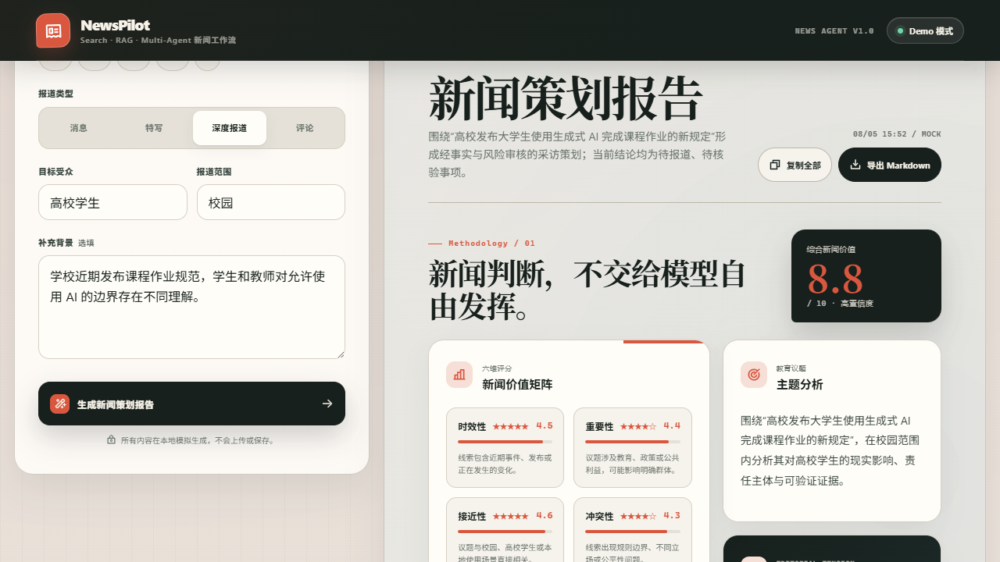
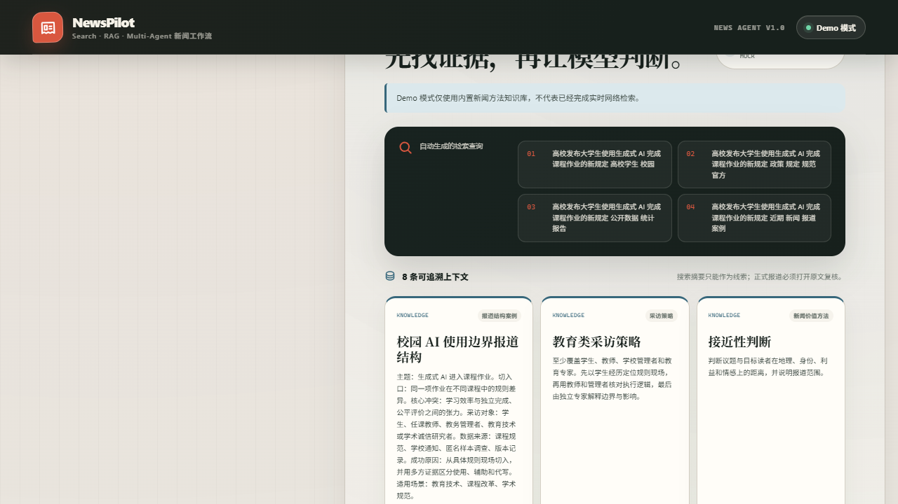
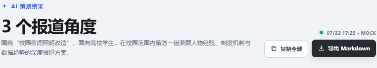

# NewsPilot AI

NewsPilot AI 是一个面向新闻学生、校园媒体和初级记者的新闻选题与采访策划助手。它把模糊主题整理为可执行的报道角度，并补齐采访对象、采访问题、事实核查任务与风险提醒。

AI-assisted news topic planning and interview preparation tool for journalism students.

当前版本以浏览器本地 Mock 为默认运行方式，不需要后端或 API Key；需要真实 AI 生成时，可选接入独立的 Node.js Generator Service 与 OpenAI Provider。

## Live Demo

[打开 NewsPilot AI 在线演示](https://newspilot-ai-ashy.vercel.app)

线上版本运行在 Vercel，固定使用浏览器本地 Mock 模式，不需要 API Key，也不会把用户输入发送到外部生成服务。

## 项目简介

NewsPilot AI 聚焦新闻报道的前期准备，而不是替代采访、调查或事实核验。用户输入主题、受众、报道范围和背景信息后，系统生成“人物、制度、数据趋势”三个结构化角度，帮助使用者从想法快速进入采访准备。

生成结果仅是策划建议。正式报道前仍需核实人物身份、制度原文、数据口径、回应权、隐私风险与素材授权。

## 产品背景

新闻初学者在选题阶段常遇到三个问题：

1. **主题过于宽泛**：知道想报道什么，却难以拆成可落地的新闻角度。
2. **采访准备分散**：采访对象、问题、事实核查任务与风险提醒缺少统一结构。
3. **AI 内容边界模糊**：生成文本容易被误当成已核验事实，需要明确来源模式和核验责任。

NewsPilot AI 将准备过程组织为：

**主题分析 → 报道角度设计 → 采访规划 → 事实核查提醒**

## 核心功能

- 填写新闻主题、报道类型、目标受众、报道范围和补充背景。
- 生成“人物、制度、数据趋势”三个固定报道角度。
- 每个角度包含新闻价值、采访对象、采访问题、事实核查清单、风险提醒和下一步行动。
- 支持复制单个角度、复制完整方案和导出 UTF-8 Markdown 文件。
- 默认使用浏览器本地 Mock，不上传输入，也不需要 API Key。
- 可选调用 Node.js Generator Service，并在 MockProvider 与 OpenAIProvider 之间切换。
- 使用 OpenAI Responses API Structured Outputs、JSON Schema 与服务端 Ajv 校验模型输出。
- OpenAI 失败时服务端降级到 MockProvider；API 不可用时前端继续降级到浏览器本地 Mock。
- 通过结果中的 <code>mode</code> 明确区分 <code>mock</code> 与 <code>openai</code>，避免混淆内容来源。

## 界面预览

### 主题输入

### 结构化策划结果

### 复制与 Markdown 导出

截图拍摄、更新和隐私检查方式见 [截图指南](docs/SCREENSHOT_GUIDE.md)。

## 技术架构

核心链路：

**User → React Frontend → Generation Service → Provider Layer → Mock Provider / AI Provider → Structured Result**

~~~mermaid
flowchart LR
    U["User"] --> F["React Frontend"]
    F --> G["Generation Service"]
    G --> P["Provider Layer"]
    P --> M["Mock Provider"]
    P --> A["AI Provider"]
    M --> R["Structured Result"]
    A --> V["JSON Schema + Ajv Validation"]
    V --> R
    A -. "失败、超时或非法结构" .-> M
    R --> F
~~~

实际运行包含两种路径：

- **本地 Mock**：<code>src/services/generator.ts</code> 直接调用共享 Mock 生成器，完全在浏览器运行。
- **API 模式**：React 前端调用 <code>POST /api/generate</code>，Node.js <code>GeneratorService</code> 选择 MockProvider 或 OpenAIProvider。

共享的 <code>BriefInput</code>、<code>GenerationResult</code> 和 JSON Schema 位于 <code>shared/generation.ts</code>。服务端只向 Provider 传递通过输入 Schema 校验的数据，并在返回 API 响应前再次校验完整结果。

### 技术栈

- React 19、Vite 7、TypeScript 5（严格模式）
- Node.js 原生 HTTP 服务
- Ajv JSON Schema 校验
- OpenAI Responses API Structured Outputs
- 原生 CSS

## 当前版本

### V0.1 Open Source Release

- 默认模式：浏览器本地 Mock。
- 可选模式：Node.js Generator Service + OpenAI Provider。
- 当前包版本：<code>0.1.0</code>。
- 当前不包含账号、权限、数据库、历史记录或生产级 API 网关。

## 快速开始

环境要求：Node.js 20.19+ 或 22.12+，以及 npm。

### 1. 安装依赖

~~~bash
npm install
~~~

### 2. 准备本地环境文件

优先复制为 <code>.env.local</code>；也可以复制为 <code>.env</code>。服务端按 <code>.env.local</code>、<code>.env</code> 的顺序读取第一个存在的文件。

macOS、Linux 或 Git Bash：

~~~bash
cp .env.example .env.local
~~~

Windows PowerShell：

~~~powershell
Copy-Item .env.example .env.local
~~~

### 3. 启动默认 Mock 模式

~~~bash
npm run dev
~~~

访问终端显示的地址，通常为 <http://localhost:5173>。默认 <code>VITE_GENERATION_MODE=mock</code>，输入不会离开浏览器。

### 4. 构建

~~~bash
npm run build
~~~

该命令构建前端 <code>dist/</code> 与服务端 <code>dist-server/</code>。可用 <code>npm run preview</code> 预览前端构建结果。

## 环境配置

<code>.env.example</code> 只包含安全示例和空密钥。复制后按运行模式修改 <code>.env.local</code> 或 <code>.env</code>，不要提交这些本地文件。

### 服务端 Mock API

~~~dotenv
VITE_GENERATION_MODE=api
GENERATION_PROVIDER=mock
~~~

分别启动两个进程：

~~~bash
# 终端 1
npm run dev:server

# 终端 2
npm run dev
~~~

前端经 Vite 开发代理请求 <code>http://127.0.0.1:8787/api/generate</code>。该模式用于验证完整 API 链路，不需要 API Key。

### 可选 OpenAI Provider

~~~dotenv
VITE_GENERATION_MODE=api
GENERATION_PROVIDER=openai
OPENAI_API_KEY=your_server_side_key
OPENAI_MODEL=gpt-5.6-terra
~~~

<code>OPENAI_API_KEY</code> 仅由服务端 <code>server/config.ts</code> 读取。不要创建 <code>VITE_OPENAI_API_KEY</code>，也不要给任何秘密加 <code>VITE_</code> 前缀；Vite 会把这类变量暴露给浏览器构建。

### 环境变量参考

| 变量 | 默认值 | 读取位置 | 说明 |
| --- | --- | --- | --- |
| <code>VITE_GENERATION_MODE</code> | <code>mock</code> | 浏览器 | <code>mock</code> 使用本地 Mock；<code>api</code> 请求 <code>/api/generate</code>。其他值按 <code>mock</code> 处理。 |
| <code>VITE_API_PROXY_TARGET</code> | <code>http://127.0.0.1:8787</code> | Vite 开发服务器 | 本地开发 API 代理地址，不得包含密钥。 |
| <code>VITE_API_TIMEOUT_MS</code> | <code>35000</code> | 浏览器 | API 请求超时，超时后降级到本地 Mock。 |
| <code>GENERATION_PROVIDER</code> | <code>mock</code> | 服务端 | <code>mock</code> 或 <code>openai</code>；其他值按 <code>mock</code> 处理。 |
| <code>SERVER_HOST</code> | <code>127.0.0.1</code> | 服务端 | Generator Service 监听地址。 |
| <code>SERVER_PORT</code> | <code>8787</code> | 服务端 | Generator Service 监听端口。 |
| <code>OPENAI_API_KEY</code> | 未设置 | 服务端 | 仅 OpenAIProvider 使用；缺失时服务端降级到 MockProvider。 |
| <code>OPENAI_MODEL</code> | <code>gpt-5.6-terra</code> | 服务端 | Responses API 模型名称。 |
| <code>OPENAI_TIMEOUT_MS</code> | <code>30000</code> | 服务端 | 单次 OpenAI 请求超时，单位毫秒。 |

## Structured Outputs 与降级链路

OpenAIProvider 调用固定的 <code>POST https://api.openai.com/v1/responses</code>，使用 <code>text.format.type=json_schema</code> 请求严格结构化输出，并设置 <code>store=false</code>。模型只返回业务内容；<code>generatedAt</code> 与 <code>mode</code> 由服务端添加。

服务端执行两层校验：

1. <code>POST /api/generate</code> 的 <code>BriefInput</code> 必须满足输入 Schema；额外字段和超长内容会被拒绝。
2. Provider 结果必须满足 <code>GenerationResult</code> Schema，三个角度必须依次为 <code>people</code>、<code>system</code>、<code>trend</code>。

降级顺序：

1. OpenAI 请求失败、超时、拒绝、JSON 非法、结构非法或缺少 Key 时，<code>GeneratorService</code> 切换到 MockProvider。
2. 浏览器无法访问服务端、请求超时、收到非 2xx 或无效 <code>GenerationResult</code> 时，前端切换到浏览器本地 Mock。

## API

### <code>POST /api/generate</code>

请求示例：

~~~json
{
  "topic": "校园夜间照明",
  "reportType": "深度报道",
  "audience": "高校学生",
  "scope": "校内",
  "background": "关注安全、能耗与学生体验"
}
~~~

成功时返回 <code>GenerationResult</code>。输入 JSON 或 Schema 不合法时返回 <code>400</code>；请求体超过 32 KiB 时返回 <code>413</code>；非 JSON Content-Type 返回 <code>415</code>；触发单进程请求窗口或并发上限时返回 <code>429</code>。响应包含 <code>Cache-Control: no-store</code>。

### <code>GET /api/health</code>

返回当前主 Provider 与降级 Provider 名称，不返回密钥。

## 构建与测试

~~~bash
# 前端与服务端生产构建
npm run build

# Schema、Provider、降级、客户端适配器和 HTTP API 测试
npm test

# 运行已构建的服务端
npm run start:server

# 预览前端构建
npm run preview
~~~

## Deployment

仓库已提供 [`vercel.json`](vercel.json)，并固定使用以下构建设置：

- Framework：Vite
- Install Command：`npm install`
- Build Command：`npm run build`
- Output Directory：`dist`

使用 Vercel Dashboard 导入本仓库，或在项目根目录执行：

~~~bash
npm install -g vercel
vercel
~~~

公开演示建议在 Vercel 的 Production 环境中设置：

~~~dotenv
VITE_GENERATION_MODE=mock
~~~

该变量不是秘密；它只选择浏览器本地 Mock。不要在 Vercel 的前端环境中配置 `OPENAI_API_KEY`，也不要创建 `VITE_OPENAI_API_KEY`。若需要真实 AI Provider，应把服务端单独部署为受保护的 API，并通过服务端 Secret 注入密钥。

## 项目结构

~~~text
NewsPilot AI/
├── docs/                         # 截图与作品集文档
├── server/
│   ├── providers/                # GenerationProvider、MockProvider、OpenAIProvider
│   ├── services/                 # GeneratorService 与服务端降级
│   ├── tests/                    # Schema、Provider、API 与客户端适配测试
│   ├── app.ts                    # HTTP 路由与请求边界
│   ├── config.ts                 # 服务端环境配置
│   └── index.ts                  # Node.js 服务入口
├── shared/                       # 共享类型、Schema、Mock 与运行时校验
├── src/
│   ├── components/               # React 界面组件
│   ├── services/                 # 客户端生成模式与 API 适配器
│   ├── utils/                    # Markdown、复制等工具
│   ├── App.tsx
│   ├── main.tsx
│   └── styles.css
├── .env.example
├── CONTRIBUTING.md
├── CHANGELOG.md
├── SECURITY.md
├── package.json
└── README.md
~~~

## 部署边界

### Vercel / GitHub Pages：静态 Mock

- 使用 <code>VITE_GENERATION_MODE=mock</code> 构建，将 <code>dist/</code> 部署到静态托管平台。
- Vercel 或 GitHub Pages 只能托管当前前端静态产物，不能直接运行仓库中的常驻 Node.js HTTP 服务。
- Vite 已使用相对资源基路径 <code>./</code>，可部署到 GitHub Pages 仓库子路径；自定义域名也可直接使用同一静态产物。
- 静态 Mock 模式不上传用户输入，适合作品集演示。

### API 模式：独立 Node.js 服务

- 单独部署 <code>dist-server/server/index.js</code>，并让前端的同源 <code>/api</code> 通过反向代理或网关转发到该服务。
- 当前服务默认监听 <code>127.0.0.1</code>，内置基础的单进程请求窗口和并发上限，但没有账号、鉴权、分布式配额或生产监控。
- 公网部署仍必须在网关层增加 TLS、访问控制、按身份分布式限流、成本保护、日志脱敏和健康检查访问策略。
- 真实密钥只放在服务端 Secret；不得进入前端环境变量、静态构建、日志或仓库。

## 内容与隐私边界

- 生成结果不是已完成的采访、调查或事实结论。
- 本地 Mock 不发送用户输入；API 模式会把输入发送到 Generator Service，OpenAI 模式还会发送给 OpenAI API。
- 应用不持久化输入，OpenAI 请求设置 <code>store=false</code>；仍不要填写无关的电话、身份证号、学号或其他敏感个人信息。
- 项目目前不提供账号、权限、数据库、多租户隔离或正式发布流程。

## Roadmap

### 已完成

- [x] MVP 界面
- [x] Mock 生成
- [x] AI Provider 架构
- [x] Markdown Export
- [x] OpenAI Structured Outputs、Ajv 校验与双层降级
- [x] 服务端、客户端与导出安全测试
- [x] GitHub Actions 测试与构建工作流

### 未来

- [ ] 新闻数据库
- [ ] 新闻知识库
- [ ] 个性化记者助手
- [ ] 多人协作编辑

## 参与贡献与安全

- 贡献流程见 [CONTRIBUTING.md](CONTRIBUTING.md)。
- 安全问题报告方式见 [SECURITY.md](SECURITY.md)。
- 版本记录见 [CHANGELOG.md](CHANGELOG.md)。

## 官方参考

- [OpenAI Structured Outputs](https://developers.openai.com/api/docs/guides/structured-outputs)
- [OpenAI Models](https://developers.openai.com/api/docs/models)
- [OpenAI API Key 安全最佳实践](https://help.openai.com/en/articles/5112595-best-practices-for-api-key)

## License

本项目采用 [MIT License](LICENSE)。
