# NewsPilot AI

[](https://github.com/jamesyu200704-star/NewsPilot-AI/actions/workflows/build.yml)
[](LICENSE)
[](https://newspilot-ai-ashy.vercel.app)

**把一个宽泛选题，转成学生记者在截止期内真正能完成的报道计划。**

NewsPilot 是面向新闻传播专业学生与校园媒体的报道工作台。它帮助用户将模糊线索转化为可采访、可核实、可执行的报道方案。它不替用户“写一篇看起来像新闻的文章”，而是把课程要求、新闻价值、选题策略、信源地图、采访问题与事实核查组织成一份可执行工作单。

AI-assisted reporting workflow for journalism students: from assignment brief to angle, sources, interview questions and verification plan.

[打开在线演示](https://newspilot-ai-ashy.vercel.app)

## 当前发布与验证状态

推荐版本：`v1.1.0-beta.1`。当前版本仍处于 Beta 阶段，尚未完成充分的真实用户验证。

当前尚未完成真实用户验证。
以下内容为测试框架或模拟演示数据。

- 真实参与者：0；真实研究场次：0；真实匿名对照评测：0。
- 已有验证：自动化测试、P0/P1/P2/P3 合成评测、生产构建与开发者 QA。
- 尚不能证明：真实学生十分钟内完成核心任务、比通用模型减少修改成本、真实设备与课程环境下的可用性。
- 仓库历史中已经存在 `v1.0.0`，但它不代表真实用户验证已完成；本次发布采用后续 Beta 版本号，完成至少一轮真实测试并处理高优先级问题后再复核稳定版资格。

研究与人工验收入口见 [`research/`](research/README.md) 和 [`qa/`](qa/README.md)。

## P2：采访执行、报道结构与提交闭环

当前 Beta 在 P1 可追溯证据链上继续提供完整执行层：

- 截止期倒排任务、依赖、阻塞、今日三件事和完成条件；
- 采访对象、替代信源、人工联系记录、预约、同意与归因边界；
- 每个问题绑定信源、主张、证据缺口、目的与预期证据；
- 专注采访模式、七类快速笔记、采访后复盘和完成门槛；
- 人工 TXT/Markdown 转写与可选本地 Whisper，未复核片段不能作为准确引语；
- 采访陈述只生成候选主张、候选引语和线索，须人工确认并独立核验；
- 十二类证据缺口、六种证据支撑报道骨架和不隐藏阻断项的作业检查；
- 九类脱敏导出，包含中文 DOCX、CSV、Markdown、JSON 和规定六文件 ZIP。


## P1：从策划到可追溯证据链

P1 在 V0.2 学生报道流程上增加了六项核心能力：

- Manual / Mock / SearXNG 三种 Search Provider；搜索失败回退手动来源，不伪造结果。
- 原始政策、官方数据和正式文件优先的可编辑检索计划，每条检索绑定 Claim ID 与用途。
- `Claim → EvidenceItem → SourceRecord` 的 ID 级追溯，事实片段保留页码、段落或小节定位。
- URL 规范化、内容哈希、近重复/转载识别和独立来源组，转载不重复计数。
- 确定性 `verified / partially_verified / unverified / conflicted` 规则与七类冲突展示。
- TXT、Markdown、PDF 文本层、DOCX、CSV、JSON 浏览器本地解析和证据台账导入。


搜索结果只是线索，不能直接作为证据。社交媒体不能单独证明关键事实；来源冲突不会自动裁决；NewsPilot 不替代记者采访，也不生成虚构引语。

## 产品边界

当前版本优先解决新闻学生最常见的前置任务：

- 我到底要交什么？
- 这个题值不值得继续做？
- 怎样把宽泛主题缩成新闻问题？
- 我该采访谁，问什么，拿到什么证据？
- 哪些信息已核实，哪些只是线索或工作假设？
- 接下来 24—48 小时应该先做什么？

当前**不会**实现账号、云端历史、多人协作、商业搜索 API、向量数据库、自动成稿、OCR、自动生成引语或复杂多 Agent 编排。没有真实采访时，系统不会声称采访已经完成，也不会生成“受访者表示”式虚假引语。

### NewsPilot 不是什么

- 不是自动写稿工具，也不替用户完成真实采访；
- 不生成虚构采访或虚构直接引语；
- 不保证搜索结果自动真实，不把搜索线索直接当证据；
- 不自动判断受访者是否说谎；
- 不替代教师、编辑或事实核查员；
- 不因模型输出流畅就把工作假设升级为事实。

采访与隐私边界：

- NewsPilot 不替代真实采访，也不生成虚构采访内容；
- 不自动发送采访邀约，不自动确定事实；
- 不自动生成可直接发表的完整稿件；
- 逐字稿和引语必须人工复核；
- 用户需要遵守所在地区、学校和采访场景的录音与隐私要求。

## 两种工作模式

### 课程作业模式（默认）

输入课程名称、作业类型、截止日期、目标字数、最低采访人数、教师要求和提交项。输出直接服务于课程采访策划案与提交前自查。

### 校园媒体模式

输入发布平台、发布时间、目标读者、校园范围和当前新闻钩子。系统优先考虑时效窗口、校园相关性、信源可达性和短周期执行。

两种模式共享同一套新闻方法，但任务优先级不同。

## 四步学生报道工作台

1. **填写任务**：用 `ReportingBrief` 描述课程或刊发约束。
2. **拆选题**：把主题转换为新闻问题，区分已知 / 假设 / 未知，给出 `GO / REVISE / HOLD / DROP` 判断并比较候选角度。
3. **做采访**：生成信源地图与八层采访问题阶梯，低可达信源同时给出替代方案。
4. **核查提交**：进入 P2 九视图执行工作台，完成任务、信源、真实采访记录、证据缺口、报道结构、自查和脱敏导出。

快速模式是独立的决策摘要，除 Verdict、推荐角度、采访对象与立即行动外，只追加前三个关键证据缺口、三类优先来源和冲突提示。完整模式第四步提供“概览 / 任务 / 采访对象 / 采访提纲 / 采访记录 / 证据 / 报道结构 / 作业自查 / 导出”九个独立视图；P1 主张与证据工作台保留在“证据”页。

## P0 可用性能力

### 粘贴并确认课程要求

课程模式可粘贴纯文本作业要求。系统确定性提取作业类型、截止时间、字数、采访人数、信源类型、人物故事、采访提纲、采访总结、格式和其他硬性约束，并逐项显示原文依据、置信度和是否需要确认。用户可修改结果；只有主动勾选确认的项目会写入任务，未确认推测不会成为硬性要求。

### 本地项目（无需账号）

页面会在浏览器本地创建项目并自动保存，支持项目列表、重命名、复制、删除、最近修改时间以及版本化 JSON 导入导出。导入时会校验格式、数据版本与关键字段，损坏文件不会覆盖当前项目。

> 项目数据只保存在当前设备的当前浏览器中。清除浏览器数据、更换设备或无痕窗口都可能导致数据不可用，请定期导出 JSON 备份。

### 人工匿名对照评测

开发/研究模式中的折叠工具可比较 NewsPilot、通用聊天模型和学生自行策划结果。后两份材料由测试人员手动粘贴，不调用新的收费 API；三份内容随机匿名为方案 A / B / C，按 13 个带 Rubric 的维度人工评分。评分必须先提交锁定，之后才允许导出匿名结果和揭示来源。

## 新闻方法与确定性规则

NewsPilot 不采用“主题 → LLM → 漂亮文本”的单跳结构。V0.2 的核心链路是：

```mermaid
flowchart LR
  B["ReportingBrief"] --> F["新闻问题与假设边界"]
  F --> V["六维新闻价值 + Verdict"]
  V --> S["十类报道策略匹配"]
  S --> A["七维候选角度评分"]
  A --> M["SourceMap"]
  M --> Q["InterviewQuestion Ladder"]
  Q --> E["Evidence Ledger"]
  E --> C["VerificationRules"]
  C --> P["StudentReportingPlan"]
```



程序层确定性执行的内容包括：

- 时效性、重要性、接近性、冲突性、人物性、趣味性六维新闻价值。
- 新闻价值、读者相关性、信源可达性、证据可获得性、时间可行性、场景潜力、伦理安全七维角度评分。
- 十类报道策略：人物特稿、校园现象调查、政策落地观察、热点本地化、数据调查、服务性报道、变化型报道、冲突型报道、场景切入型报道、群像报道。
- 原始来源、双独立来源、社交媒体线索和来源冲突的基础交叉验证规则。

## AI 与资料层如何参与

普通用户首页不需要理解 Provider。默认浏览器 Mock 可完整体验学生报道工作流，输入不会离开浏览器。

开发者可在页面底部展开“开发者设置”，启用项目已有的 Qwen/Ollama/OpenAI Provider。模型可以辅助拆分主张、建议检索词和归纳短摘要，但来源真实性、独立性、Evidence ID 和最终核实状态仍由可验证代码与用户确认控制。

P1 支持 Manual、明确标记的 Mock 与可选自托管 SearXNG。旧版 Brave Search 保留用于兼容旧工作流，不进入 P1 证据核实链路。SearXNG 返回的摘要仍为 `metadata_only / lead_only`；必须成功取得原始页面并由用户确认短片段，才进入核验矩阵。

## 结果数据模型

- `ReportingBrief`：任务、截止期、字数、信源、材料、资源和伦理限制。
- `TopicFrame`：原始主题、新闻问题、工作假设、已知、未知和核实需求。
- `Verdict`：`GO / REVISE / HOLD / DROP`、理由、最大风险、收窄建议与最小可行版本。
- `CandidateAngle`：策略、核心矛盾、七维评分、所需证据和可行性说明。
- `SourceMapItem`：角色、信息价值、可达性、偏差、替代信源和核实目标。
- `InterviewPlan`：破冰、事实、经历、原因、冲突、验证、追问、收尾八层问题。
- `Claim`：事实、观点、假设、指控、预测或统计主张，以及重要性、范围和缺口。
- `SourceRecord`：来源类型、等级、规范 URL、转载关系、独立来源组和分类历史。
- `EvidenceItem`：可定位短片段、与 Claim 的支持/反驳/背景关系和直接性。
- `ClaimEvidenceMatrixRow`：独立来源数、原始来源数、核实状态、规则理由与剩余工作。
- `StudentReportingPlan`：完整学生报道方案。

## 快速开始

需要 Node.js 20.19+（推荐 Node.js 22）和 npm。

```bash
npm install
npm run dev
```

浏览器访问 Vite 输出的地址，通常为 `http://localhost:5173`。默认 `VITE_GENERATION_MODE=mock`，无需 API Key。

生产构建与测试：

```bash
npm test
npm run build
npm run eval:campus
npm run eval:p1
npm run eval:p2
npm run eval:p3
```

`eval:campus` 运行 20 个校园策划案例。`eval:p1` 运行 30 个合成证据案例，最重要门槛是关键事实 `False Verification Rate = 0`。`eval:p2` 运行 20 个合成执行项目，覆盖十项执行指标。`eval:p3` 检查研究数据隔离、匿名性、盲评完整性、事件隐私、问题优先级、发布判断、示例安全和功能冻结。评测不访问真实网络，也不代表真实事实、真实用户效果或新闻质量。

## 搜索模式与本地完整模式

### Vercel Demo

支持浏览器本地项目、作业解析、Mock 策划、手动证据、手动采访记录、手动逐字稿、大纲与导出。公开 Demo 的 `VITE_RESEARCH_MODE=false`，不运行研究记录、Express、SearXNG、Local Whisper 或服务端模型。

### 本地完整模式

纯前端 Demo 使用 `VITE_EVIDENCE_MODE=mock`：模拟卡明确标识，仍可手动粘贴来源、上传本地材料和维护证据台账。

本地完整模式可额外启用 Ollama + Qwen、SearXNG、Local Whisper 和仅本机研究模式：

```powershell
Copy-Item .env.example .env.local
```

```dotenv
VITE_EVIDENCE_MODE=live
VITE_RESEARCH_MODE=false
SEARCH_PROVIDER=searxng
SEARXNG_BASE_URL=http://localhost:8080
```

```bash
pwsh -File scripts/初始化SearXNG配置.ps1
docker compose -f docker-compose.search.yml up -d
npm run dev
```

可选本地转写（公开部署保持 `manual`）：

```dotenv
TRANSCRIPTION_PROVIDER=local_whisper
LOCAL_WHISPER_BASE_URL=http://localhost:9000
TRANSCRIPTION_MAX_FILE_MB=100
```

本地 Whisper 只允许回环地址；音频不会写入 NewsPilot 项目或上传云端。服务不可用时改用人工粘贴，不丢失已有记录。

首次使用必须先运行初始化脚本：它会从 `searxng/settings.yml.example` 创建被 Git 忽略的 `searxng/settings.yml`，并写入本机随机 secret，且不会在终端显示 secret。Compose 只把端口发布到 `127.0.0.1`；示例占位值禁止用于公开部署。详细说明见 [搜索架构](docs/SEARCH_ARCHITECTURE.md) 与 [SearXNG 配置](docs/SEARCH_SETUP.md)。

## 可选本地 Qwen / Ollama

本地模型不是普通用户使用 V0.2 的前提。需要验证 Provider 时：

```bash
ollama pull qwen2.5:1.5b
```

复制环境示例：

```powershell
Copy-Item .env.example .env.local
```

修改 `.env.local`：

```dotenv
VITE_GENERATION_MODE=local-ai
GENERATION_MODE=qwen
OLLAMA_BASE_URL=http://localhost:11434
OLLAMA_MODEL=qwen2.5:1.5b
```

随后启动 Ollama 与项目：

```bash
ollama serve
npm run dev
```

如果模型未启动、输出结构非法或后端不可达，系统会明确提示并回到浏览器 Mock。若将 `OLLAMA_BASE_URL` 改为远程地址，输入会发送到该服务，请自行确认信任与隐私边界。

## 环境变量与密钥安全

`.env.example` 只包含空密钥与安全示例。真实配置放在未跟踪的 `.env.local` 或 `.env` 中。

| 变量 | 默认值 | 位置 | 用途 |
| --- | --- | --- | --- |
| `VITE_GENERATION_MODE` | `mock` | 浏览器 | `mock` 或 `local-ai`；不得包含秘密。 |
| `VITE_EVIDENCE_MODE` | `mock` | 浏览器 | `mock` 或 `live`，不包含搜索地址或秘密。 |
| `GENERATION_MODE` | `mock` | 服务端 | `mock`、`qwen`、`ollama`、`openai`。 |
| `OLLAMA_BASE_URL` | `http://localhost:11434` | 服务端 | Ollama 地址。 |
| `OLLAMA_MODEL` | `qwen2.5:1.5b` | 服务端 | 本地模型名称。 |
| `OPENAI_API_KEY` | 空 | 服务端 | 可选 OpenAI Provider 密钥。 |
| `OPENAI_MODEL` | 示例值 | 服务端 | OpenAI 模型名称。 |
| `SEARCH_PROVIDER` | `manual` | 服务端 | `manual`、`mock` 或 `searxng`。 |
| `SEARXNG_BASE_URL` | 本机 8080 | 服务端 | 自托管 SearXNG 地址，不返回浏览器。 |
| `SEARCH_RESULT_LIMIT` | `10` | 服务端 | 单条检索最多结果数，上限 20。 |
| `SEARCH_TIMEOUT_MS` | `10000` | 服务端 | 搜索与页面获取超时。 |
| `SEARCH_RATE_LIMIT_PER_MINUTE` | `10` | 服务端 | 单进程证据接口基础限流。 |
| `TRANSCRIPTION_PROVIDER` | `manual` | 服务端 | `manual` 或仅本机的 `local_whisper`。 |
| `LOCAL_WHISPER_BASE_URL` | 本机 9000 | 服务端 | 仅允许回环地址的本地转写服务。 |
| `TRANSCRIPTION_MAX_FILE_MB` | `100` | 服务端 | MP3/WAV/M4A/WebM 上限。 |
| `SEARCH_MAX_CONCURRENT_FETCHES` | `3` | 服务端 | 单进程网页抓取并发上限，上限 10。 |
| `VITE_UPLOAD_MAX_FILE_MB` | `10` | 浏览器公开配置 | 单文件默认限制，只能填写非敏感数字。 |
| `VITE_UPLOAD_MAX_PROJECT_MB` | `50` | 浏览器公开配置 | 单项目材料默认限制，只能填写非敏感数字。 |
| `VITE_RESEARCH_MODE` | `false` | 浏览器公开配置 | 仅本地研究工具；公开 Demo 必须关闭。 |
| `UPLOAD_MAX_FILE_MB` | `10` | 服务端预留 | 未来受控上传接口的单文件限制。 |
| `UPLOAD_MAX_PROJECT_MB` | `50` | 服务端预留 | 未来受控上传接口的单项目限制。 |
| `SEARCH_MODE` | `mock` | 服务端 | 旧版兼容检索开关。 |
| `BRAVE_SEARCH_API_KEY` | 空 | 服务端 | 旧版 Brave Provider 可选密钥。 |

不要创建 `VITE_OPENAI_API_KEY`、`VITE_BRAVE_SEARCH_API_KEY` 或任何带 `VITE_` 前缀的秘密；Vite 会把这类变量打包到浏览器。

## 项目结构

```text
NewsPilot AI/
├── evals/
│   ├── 校园报道题库.ts           # 20 个案例与六维半自动评测
│   ├── p1-evidence/              # 30 个证据链与对抗评测案例
│   ├── p2-execution/             # 20 个采访执行与隐私硬门槛评测
│   ├── p3-validation/            # 研究、盲评、隐私与发布判断
│   └── 运行校园报道评估.ts
├── searxng/settings.yml.example  # 可提交的 SearXNG 示例；实配文件被忽略
├── scripts/初始化SearXNG配置.ps1 # 生成本机随机 secret
├── strategy-library/
│   └── 报道策略.ts               # 十类学生报道策略卡
├── rules/
│   ├── 新闻规则.ts               # 旧版主题规则，继续兼容 Provider
│   └── 交叉验证规则.ts           # 基础 VerificationRules
├── shared/
│   ├── 学生报道模型.ts           # V0.2 领域类型
│   ├── 学生报道工作流.ts         # ReportingBrief → StudentReportingPlan
│   ├── 作业要求解析.ts           # 十类课程要求提取与确认门槛
│   ├── 快速策划摘要.ts           # 七类快速决策信息
│   ├── 人工盲评.ts               # 13 维匿名评审、评分后揭盲与导出
│   ├── 产品验证.ts               # 研究、指标、问题、冻结与 Release Gate
│   ├── 本地项目模型.ts           # 版本化项目格式与损坏校验
│   ├── 证据领域模型.ts           # Claim / Source / Evidence / Matrix
│   ├── 报道执行模型.ts           # Task / Source / Session / Quote / Gap / Outline
│   ├── 执行计划器.ts             # 截止期倒排、依赖与阻塞
│   ├── 采访证据处理.ts           # 候选材料与人工纳入门槛
│   ├── 报道提交检查.ts           # 提纲支撑与作业阻断检查
│   ├── 报道导出.ts               # DOCX / CSV / Markdown / ZIP
│   ├── 来源去重.ts               # URL、近重复、转载和独立来源组
│   ├── 核验规则.ts               # 保守的确定性交叉核验
│   └── generation.ts             # 既有 Provider 共享契约
├── src/
│   ├── components/
│   │   ├── 报道任务表单.tsx
│   │   ├── 作业要求解析器.tsx
│   │   ├── 本地项目栏.tsx
│   │   ├── 人工盲评工具.tsx
│   │   ├── 工作流导航.tsx
│   │   ├── 学生报道结果.tsx
│   │   ├── 证据工作台.tsx
│   │   ├── 报道执行工作台.tsx
│   │   ├── 研究分析页.tsx         # 仅研究模式可见的本地分析
│   │   ├── 执行工作台/            # P2 九个独立视图
│   │   └── 开发者设置.tsx
│   ├── services/本地项目仓库.ts
│   ├── services/学生策划服务.ts
│   └── utils/学生策划案导出.ts
├── server/search/p1/              # Manual / Mock / SearXNG Provider
├── server/sources/                # SSRF 防护抓取与正文提取
├── server/transcription/          # 可选回环 Local Whisper Provider
├── docs/                          # P1/P2 架构、安全、隐私与工作流文档
├── qa/                            # P2 人工验收清单与可导入夹具
├── research/                      # P3 招募、同意、协议与空模板
├── examples/                      # 三套虚构、脱敏、可公开示例
├── release/                       # Beta 说明、功能冻结与门槛状态
├── 用户测试/                     # 旧版 P0 用户测试材料
├── .env.example
├── CONTRIBUTING.md
├── CHANGELOG.md
├── LICENSE
└── README.md
```

## 测试与评测

自动测试覆盖：

- `ReportingBrief` 到新闻问题、假设边界与 Verdict 的转换。
- 十类策略匹配与三候选角度排序。
- 每类信源的八层问题阶梯，以及诱导性 / 一题多问标记。
- 原始来源、双独立来源、社交线索和来源冲突规则。
- AI / Search 结果只能作为未核实线索。
- Markdown 导出的完整章节与注入转义。
- Provider、Structured Output、降级链路、API 和健康检查等既有测试。
- 20 个校园报道案例的六维回归评测。
- 30 个 P1 合成证据案例的九项指标，False Verification Rate 强制为 0。
- URL 规范化、近重复与转载、独立来源分组、来源分级、冲突和引用完整性。
- SearXNG 成功/超时/失败、重定向、404/非 HTML/大响应与 SSRF 阻断。
- 六种材料格式、DOCX 宏/压缩风险、扫描 PDF 边界和提示词注入隔离。
- 快速模式七类信息边界、作业要求人工确认、本地项目生命周期与损坏导入校验。
- 三类方案的匿名盲评包、13 维 Rubric、评分后揭盲和匿名 JSON/CSV 导出。
- P2 截止期倒排、任务依赖、状态机、同意、问题绑定、引语追溯、缺口任务、提纲支撑、作业检查、脱敏和 v2→v3 迁移。
- 人工转写、本地音频双重校验、DOCX 隐私过滤和六文件提交包完整性。
- 20 个 P2 离线合成项目的十项指标及四项必须为零的硬错误。
- P3 的真实/模拟数据隔离、匿名参与者、事件脱敏、问题分级、Release Gate、功能冻结和公开示例安全。

自动测试与校园题库评测只检查代码结构、方法约束和安全边界，不等同于新闻专业教师对真实报道质量的人工评分，也不能证明学生任务完成效率已经提升。

P3 研究材料位于 [`research/`](research/README.md)，旧版 P0 材料保留在 [`用户测试/`](用户测试/README.md)。当前尚未开展真实测试、没有参与者记录，也没有可报告的用户效果。目标是招募 8—12 名新闻传播专业学生，至少覆盖 2 名校园媒体成员、2 名无独立采访经验者和 2 名使用过通用 AI 工具者；覆盖人物特稿、校园调查、政策观察后再依据真实观察迭代。

## 部署

仓库包含 `vercel.json`。静态 Vercel 演示建议使用：

```dotenv
VITE_GENERATION_MODE=mock
VITE_EVIDENCE_MODE=mock
VITE_RESEARCH_MODE=false
```

Vercel 会执行 `npm ci` 与 `npm run build`，输出目录为 `dist`。静态部署可运行 Mock、手动来源、本地上传、人工转写、任务/采访记录、报道提纲、作业检查和浏览器端 DOCX/ZIP 导出；不会运行 Express、SearXNG、网页抓取或本地 Whisper。实时搜索、Qwen/Ollama/OpenAI 和本地 Whisper 需要单独运行受保护的本地/服务端组件。

GitHub Pages 也可托管 Mock 静态版，Vite `base: './'` 已兼容子路径资源；真实 Provider 不应直接暴露在公开静态站点。

## 当前限制与后续方向

- 当前 Verdict、策略匹配与问题模板是可解释的基础规则，不能代替教师或编辑判断。
- 本地材料会读取可支持格式的文本；扫描 PDF 没有 OCR，复杂表格和版式可能丢失。
- 没有自动采访、站内录音或完整报道写作；可选本地 Whisper 仍要求人工复核。
- 公开 Demo 不提供实时搜索；完整模式需要用户自己运行或部署 SearXNG。
- 没有账号、云历史、协作、数据库与向量检索。
- 20 题评测主要验证工作流完整性与安全边界，真实新闻质量仍需人工评估。
- 十类策略的执行与伦理元数据已补齐，但目前没有引入未经核验的教材、论文或案例引用；来源状态均为“待人工审核”。
- 作业要求解析只处理用户粘贴的文本，不读取 PDF 或 Word；表达含糊时仍需人工判断。
- 本地项目使用浏览器存储，不提供账号、云同步、跨设备恢复或多人协作。
- 人工盲评工具只记录评分，不自动宣布“更优方案”；真实对照评测仍需招募测试者与独立评审。
- 近重复与原始出处判断是轻量规则，无法替代编辑对真实采写独立性的人工判断。
- 单进程限流、固定客户端头不是生产级鉴权；当前后端不能直接作为匿名公共搜索代理。
- 完整限制见 [P2 当前限制](docs/P2_LIMITATIONS.md)。

## P1 文档

- [搜索架构](docs/SEARCH_ARCHITECTURE.md) · [配置](docs/SEARCH_SETUP.md) · [证据模型](docs/EVIDENCE_MODEL.md)
- [来源等级](docs/SOURCE_RANKING.md) · [去重](docs/DEDUPLICATION.md) · [核验规则](docs/VERIFICATION_RULES.md)
- [冲突处理](docs/CONFLICT_HANDLING.md) · [上传解析](docs/UPLOAD_AND_PARSING.md)
- [搜索安全](docs/SEARCH_SECURITY.md) · [隐私说明](docs/PRIVACY.md)

## P2 文档

- [执行工作流](docs/EXECUTION_WORKFLOW.md) · [任务倒排](docs/TASK_PLANNING.md) · [采访对象与联系](docs/SOURCE_AND_OUTREACH.md)
- [采访模式](docs/INTERVIEW_MODE.md) · [转写](docs/TRANSCRIPTION.md) · [引语政策](docs/QUOTE_POLICY.md)
- [采访证据](docs/INTERVIEW_EVIDENCE.md) · [缺口关闭](docs/EVIDENCE_GAP_CLOSURE.md) · [报道提纲](docs/STORY_OUTLINE.md)
- [作业检查](docs/ASSIGNMENT_CHECK.md) · [DOCX 导出](docs/DOCX_EXPORT.md) · [隐私脱敏](docs/PRIVACY_AND_REDACTION.md) · [当前限制](docs/P2_LIMITATIONS.md)

## 开源协作

提交 Issue 或 Pull Request 前请阅读 [CONTRIBUTING.md](CONTRIBUTING.md)。安全问题见 [SECURITY.md](SECURITY.md)。重要变化记录在 [CHANGELOG.md](CHANGELOG.md)。

## License

[MIT License](LICENSE)
